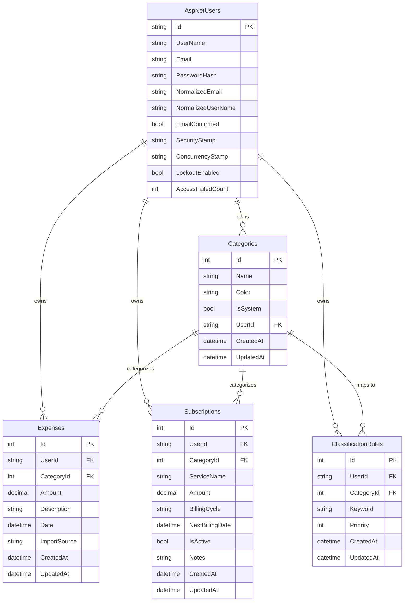

# FinFlow ER図・テーブル定義書

## ER図（Mermaid）

## テーブル定義

### Categories（カテゴリ）

| カラム名 | 型 | 制約 | 説明 |
|---------|-----|------|------|
| Id | int | PK, IDENTITY | カテゴリID |
| Name | nvarchar(100) | NOT NULL | カテゴリ名 |
| Color | nvarchar(7) | NOT NULL, DEFAULT '#6B7280' | 表示色（HEXコード） |
| IsSystem | bit | NOT NULL, DEFAULT 0 | システム定義カテゴリフラグ |
| UserId | nvarchar(450) | NULL, FK(AspNetUsers.Id) | ユーザーID（NULLはシステム共通） |
| CreatedAt | datetime2 | NOT NULL | 作成日時 |
| UpdatedAt | datetime2 | NOT NULL | 更新日時 |

**インデックス:** IX_Categories_UserId

**初期データ（IsSystem=true）:**
- 食費 (#F59E0B)
- 交通費 (#3B82F6)
- 娯楽 (#8B5CF6)
- 日用品 (#10B981)
- 医療費 (#EF4444)
- 光熱費 (#F97316)
- 通信費 (#06B6D4)
- その他 (#6B7280)

---

### Expenses（支出）

| カラム名 | 型 | 制約 | 説明 |
|---------|-----|------|------|
| Id | int | PK, IDENTITY | 支出ID |
| UserId | nvarchar(450) | NOT NULL, FK(AspNetUsers.Id) | ユーザーID |
| CategoryId | int | NULL, FK(Categories.Id) | カテゴリID |
| Amount | decimal(18,2) | NOT NULL | 金額 |
| Description | nvarchar(500) | NULL | 説明・メモ |
| Date | date | NOT NULL | 支出日 |
| ImportSource | nvarchar(50) | NULL | CSV取込元（例: "generic", "mufg", "rakuten"） |
| CreatedAt | datetime2 | NOT NULL | 作成日時 |
| UpdatedAt | datetime2 | NOT NULL | 更新日時 |

**インデックス:** IX_Expenses_UserId, IX_Expenses_Date, IX_Expenses_CategoryId

---

### Subscriptions（サブスクリプション）

| カラム名 | 型 | 制約 | 説明 |
|---------|-----|------|------|
| Id | int | PK, IDENTITY | サブスクID |
| UserId | nvarchar(450) | NOT NULL, FK(AspNetUsers.Id) | ユーザーID |
| CategoryId | int | NULL, FK(Categories.Id) | カテゴリID |
| ServiceName | nvarchar(200) | NOT NULL | サービス名 |
| Amount | decimal(18,2) | NOT NULL | 月額/年額金額 |
| BillingCycle | nvarchar(20) | NOT NULL | 請求サイクル（"monthly", "yearly"） |
| NextBillingDate | date | NOT NULL | 次回請求日 |
| IsActive | bit | NOT NULL, DEFAULT 1 | 有効フラグ |
| Notes | nvarchar(500) | NULL | メモ |
| CreatedAt | datetime2 | NOT NULL | 作成日時 |
| UpdatedAt | datetime2 | NOT NULL | 更新日時 |

**インデックス:** IX_Subscriptions_UserId, IX_Subscriptions_NextBillingDate

---

### ClassificationRules（自動分類ルール）

| カラム名 | 型 | 制約 | 説明 |
|---------|-----|------|------|
| Id | int | PK, IDENTITY | ルールID |
| UserId | nvarchar(450) | NOT NULL, FK(AspNetUsers.Id) | ユーザーID |
| CategoryId | int | NOT NULL, FK(Categories.Id) | 分類先カテゴリID |
| Keyword | nvarchar(200) | NOT NULL | マッチキーワード |
| Priority | int | NOT NULL, DEFAULT 0 | 優先度（高いほど先にマッチ） |
| CreatedAt | datetime2 | NOT NULL | 作成日時 |
| UpdatedAt | datetime2 | NOT NULL | 更新日時 |

**インデックス:** IX_ClassificationRules_UserId
